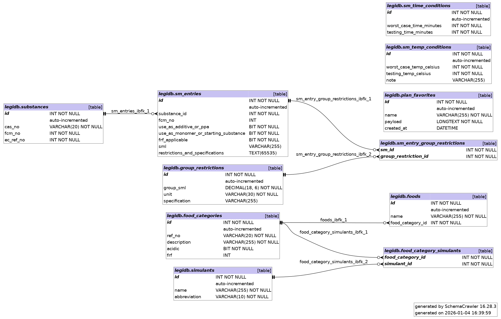

## Motivation
I have this delusion that makes me think laws easy to follow (weird, I know). Unfortunately legislators and authors of legal documents appear to disagree. Laws are written in the most incomprehensible fashion imaginable, information is scattered across a thousand pages and fifteen different documents and, of course, there is not only no comprehensive database that one could query to find out what laws one may potentially be violating - there is in fact no public database at all! Unsurprisingly, this gives massive multi-national corporations that can afford to pay a dozen people to do nothing but read legislation all day long an unfair competitive advantage.

## About the project
I chose the EU regulation 10/2011 `Commission Regulation (EU) No 10/2011 of 14 January 2011 on plastic materials and articles intended to come into contact with food Text with EEA relevance` to create a proof of concept, simply because I am somewhat familiar with the regulation. There is nothing inherently special about the EU in this regard, other regulatory bodies are just as bad, and often worse.

### Schema


generated with `schemacrawler` and `graphviz`

```
nix shell nixpkgs#schemacrawler nixpkgs#graphviz --command \
  schemacrawler \
    --server=mysql \
    --host=127.0.0.1 --port=3307 \
    --database=legidb --user=legidb --password=legidb \
    --info-level=standard \
    --command=schema \
    --output-format=png \
    --output-file=docs/schema.png
```

## Installation
### Nix (native)
To simply test the page you can initialize the db using `nix run github:chemonke/legidb#db-start`
and start the flask app with `nix run github:chemonke/legidb#app`
If you have cloned the repo you can do the same with `nix run .#db-start` and `nix run .#app`

If you want to on the code, clone the repo and run `nix develop` to enter the devshell.

To stop and remove the db use `nix run .#db-stop -- --clean`. If you wish to preserve modifications you made, omit the `-- -- clean` flag.


## Planner API SQL
The planner API is built from a few simple SQL pulls. Below is a single-query version of the substance block that powers the plan generation. It fetches substances, their specific migration (SM) entries, and any linked group limits in one go.

```sql
-- Substitute :sub_ids with the IDs you want (e.g. :sub_id_0 = 1, :sub_id_1 = 2 …).
WITH picked_substances AS (
  SELECT s.id,
         s.cas_no,
         s.fcm_no,
         s.ec_ref_no,
         se.id AS sm_entry_id,
         se.use_as_additive_or_ppa,
         se.use_as_monomer_or_starting_substance,
         se.frf_applicable,
         se.sml,
         se.restrictions_and_specifications
  FROM substances s
  LEFT JOIN sm_entries se ON se.substance_id = s.id
  WHERE s.id IN (:sub_id_0, :sub_id_1, :sub_id_2) -- supply only as many placeholders as needed
),
group_limits AS (
  SELECT sgr.sm_id,
         gr.id AS group_restriction_id,
         gr.group_sml,
         gr.unit,
         gr.specification
  FROM group_restrictions gr
  JOIN sm_entry_group_restrictions sgr ON sgr.group_restriction_id = gr.id
)
SELECT ps.*,
       gl.group_restriction_id,
       gl.group_sml,
       gl.unit,
       gl.specification
FROM picked_substances ps
LEFT JOIN group_limits gl ON gl.sm_id = ps.sm_entry_id
ORDER BY ps.cas_no;
```

How it maps to the planner UI:
- The `picked_substances` CTE is what the planner uses to render CAS, FCM, EC, SML, FRF flags, and any restriction text.
- The `group_limits` join provides the “Group SML” badges shown under each compound.
- Similar helper queries fetch foods plus their simulants (`foods` → `food_categories` → `food_category_simulants` → `simulants`) and the time/temperature tables (`sm_time_conditions`, `sm_temp_conditions`), which are then combined into the final JSON response by the `/api/generate-plan` endpoint.
